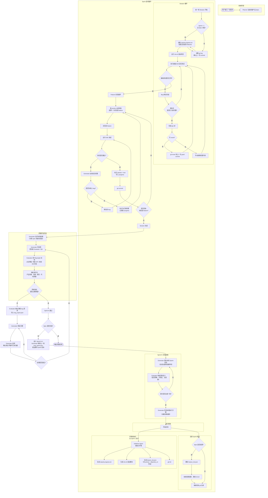

# 研发层流程图 v2.0

Generated from: Anthropic "Effective Harnesses" + "Harness Design Long-Running Apps"
Incorporating: P0/P1/P2/P3 adjustments

---

## 变更对照表

### P0（必须修复）

#### 1. 拆分 "项目完成" → Session Complete / Sprint Pass
**原图：** 所有 feature 实现后直接走 QA，没有区分
**v2：** 添加了 `Session 完成` 中间节点，明确 QA 是 Sprint 级别评审，不是 Session 结束的直接结果

#### 2. 加入 Git Revert 路径
**原图：** Bug fix 后没有回退机制
**v2：** 添加了 `检查 git diff → 可 revert? → git revert 到上一次 good commit` 路径，防止修复引入更多问题

---

### P1（提升鲁棒性）

#### 3. Feature 选择策略
**原图：** `选择一个未完成 feature`（随机）
**v2：** `按 priority 从高到低选择一个未完成 feature`，feature_list.json 结构增加了 `priority` + `depends_on` 字段

#### 4. Evaluator 历史报告跨 Sprint 传递
**原图：** 每轮 Sprint 独立，bug_report 只影响本轮修复
**v2：** Sprint N+1 开始时，Generator 携带上一轮 bug_report.json 作为背景信息，影响新 Sprint 的目标提出

#### 5. Bug Fix 后自测
**原图：** 修复后直接交给 Evaluator
**v2：** Generator 自测 → 通过 → 再提交给 Evaluator，避免浪费 QA 轮次

#### 6. 后续 Sprint Init Agent 行为
**原图：** 后续 Sprint 是否还跑 init 不明确
**v2：** 添加了 `Spec 是否变更?` 判断分支，仅在变更时更新 feature_list.json 和 init.sh，git 仓库始终继承

---

### P2（表达清晰度）

#### 7. "宣读编写代码" 拆分为宣读 + 执行
**原图：** `Generator 宣读编写代码并实现功能`
**v2：** 拆为 `Generator 宣读本轮执行方案` → `开始任务`，对应前面的协商结果

#### 8. 基础测试判断标准量化
**原图：** `系统是否正常？` 无量化标准
**v2：** 在 sanity_check 节点旁标注"所有 passes = true 的 feature 回归测试通过"

#### 9. Bug Fix 分类
**原图：** 所有测试失败统一处理
**v2：** 区分"核心 bug"（立即修）和"已知问题"（记录 defer），避免在非关键问题上卡住

---

## 节点一览表

| 节点 | 类型 | 说明 |
|------|------|------|
| 用户输入 | 起点 | 一句需求 |
| Planner 生成 Spec | 执行 | 一次性 |
| Generator 提出 Sprint 目标 | 执行 | 带 priority + depends_on |
| Evaluator 审核目标 | 执行 | 协商循环 |
| Generator 宣读执行方案 | 执行 | 对接协商结果 |
| Initializer Agent | 执行 | 仅 Sprint 1 |
| 后续 Sprint 检查 | 判断 | Spec 变更? |
| Session 初始化 | 执行 | 读 progress / git log |
| 运行 init.sh | 执行 | 每次 Session |
| 基础 E2E 测试 | 执行 | 回归验证 |
| 系统正常? | 判断 | 回归失败→修 |
| Git revert 路径 | 执行 | 可选 |
| 按 priority 选 feature | 执行 | 带依赖解析 |
| 实现 feature | 执行 | 单元级 |
| E2E 测试 | 执行 | feature 级 |
| 测试通过? | 判断 | 失败→fix/defer |
| git commit | 执行 | feature 级 |
| 还有未完成 feature? | 判断 | 循环/结束 |
| Session 完成 | 里程碑 | 内部节点 |
| Generator 自评 | 执行 | 对照 spec |
| Evaluator Playwright QA | 执行 | Sprint 级 |
| 评分 | 执行 | 四维标准 |
| 指标过硬阈值? | 判断 | Sprint 通过条件 |
| 输出详细 bug 清单 | 执行 | bug_report.json |
| Generator 修复 | 执行 | 含自测验证 |
| 自测通过? | 判断 | 防引入新 bug |
| Sprint N 通过 | 里程碑 | 可进下一 Sprint |
| Spec 完成? | 判断 | 整体结束条件 |
| 输出完整应用 | 终点 | — |

---

## artifact 一览表

| 文件 | 创建节点 | 更新节点 | 用途 |
|------|----------|----------|------|
| `spec.json` | Planner | — | 产品规格（一次性） |
| `feature_list.json` | Initializer Agent | 后续 Sprint 检查 | 需求清单（带 priority） |
| `claude-progress.txt` | Initializer Agent | 每个 feature 完成后 | 已完成工作记录 |
| `init.sh` | Initializer Agent | 后续 Sprint 检查 | 启动脚本 |
| `bug_report.json` | Evaluator | — | 当前 Sprint 的 QA 反馈 |
| `git history` | Initializer Agent | 每个 feature 完成后 | 可回滚的版本历史 |
